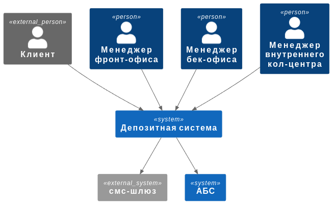

### **Название задачи: Цифровизация работы с депозитами** 
### **Автор: Кукушкин Д.Е.**
### **Дата: 2.02.25**

### **Функциональные требования**

|**№**|**Действующие лица или системы**|**Use Case**|**Описание**|
| :-: | :- | :- | :- |
|1 |Клиент, Менеджер бек-офиса|Подача заявки на вклад|1. Клиент выбирает вклад и пишет сколько денег он хочет положить, также оставляет свой номер телефона и ФИО  2. Заявка добавляется в базу и клиенту отправляется смс.  3. Клиент подтверждает смс  4. Уведомление о новой заявки отправляется в бэк-офис  5. После обработки заявки клиенту отправляется смс-уведомление|
|2 |Новый клиент, Менеджер кол-центра|Регистрация клиента| 1. Если клиент новый, то при рассмотрении заявки бек-офисом ему будет предложено прейти в отделение банка и зарегистрироваться.  2. Также его заявка будет передана в кол-центр, чтобы менеджер мог подготовить особые условия.|

### **Нефункциональные требования**
Опишите здесь нефункциональные требования и архитектурно-значимые требования.

|**№**|**Требование**|
| :-: | :- |
|1| Интерфейс сайта для вкладов должен быть удобен для клиентов, в том числе и пожилых людей |
|2| Нужно обеспечить высокий отклик по всем при работе с заявками на вклады |
|3| Нужно придерживаться код-стайла компании|
|4| Нужно обеспечить механизм бекапов |
|5| Нужно разработать план на случай выход ЦОД из строя |
|6| При разработке надо опираться на технологии в которых уже есть опыт у сотрудников|

### **Решение**

Основная задача была сделать работу надежной и доступной.
Из-за чего вся новая функциональность реализуется в микросервисах для которых не трудно реализовать горизонтальное масштабирование.
Сейчас sso обслуживает только внутреннею инфраструктуру компании, однако в будущем позволит упростить работу с новыми клиентами.

Диаграмма контекста

Диаграмма контейнеров

### **Альтернативы**
В теории данный функционал можно было бы интегрировать в АБС однако такой подход может привести к большим издержкам при расширении и увеличении нагрузки.

**Недостатки, ограничения, риски**

Текущее решение не предполагает использование системы очередей, однако в будущем она может потребоваться.
Также в рамках микросервисной архитектуры мы имеем несколько БД данные между которыми необходимо будет согласовывать.