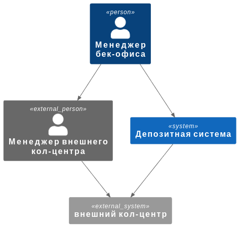
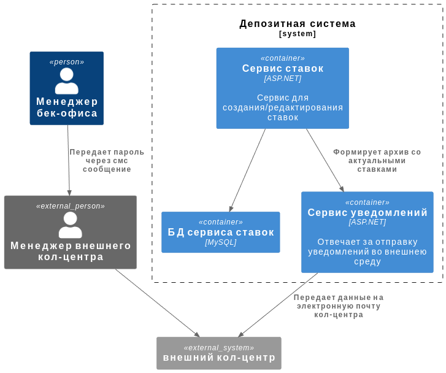
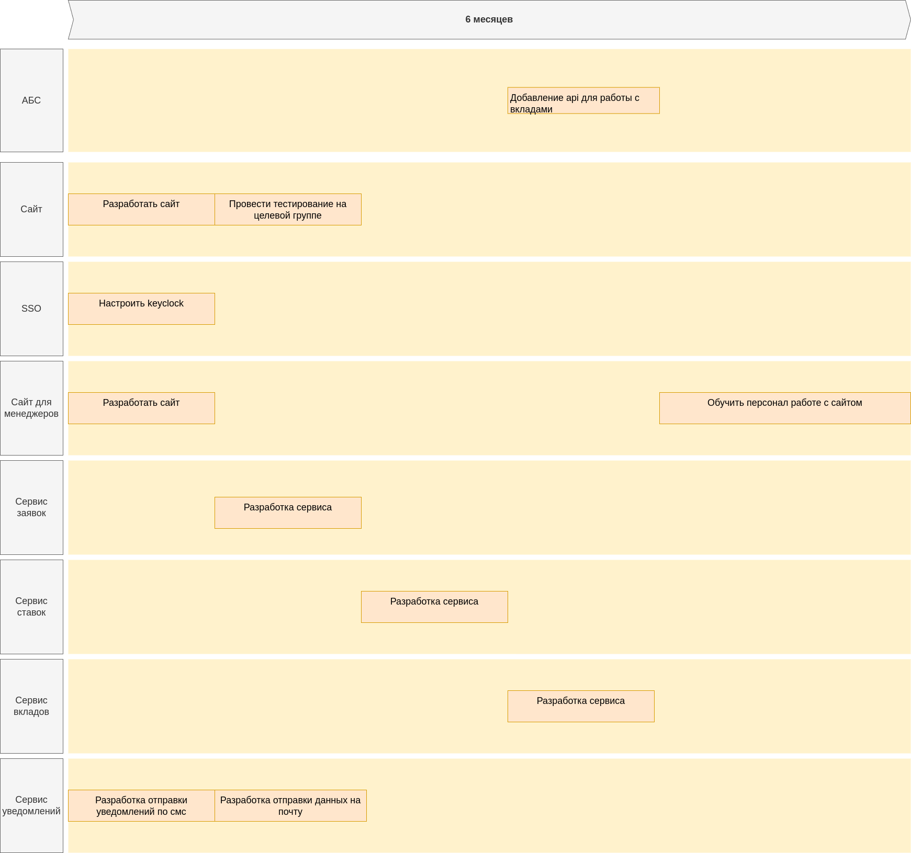

### **Название задачи: Цифровизация работы с депозитами** 
### **Автор: Кукушкин Д.Е.**
### **Дата: 2.02.25**

### **Функциональные требования**

|**№**|**Действующие лица или системы**|**Use Case**|**Описание**|
| :-: | :- | :- | :- |
|1 |Менеджер внешнего кол-центра, менеджер бек-офиса, система ставок, система уведомлений|Получение ставок внешним кол-центром|1. В определенное время(Надо обговорить с бек-офисом) сервис ставок формирует таблицу ставок и архивирует ее  2. Архив передается в систему уведомлений и отправляется на почту.  3. Ответственный человек передает пароль через смс.  4. Менеджер кол-центра скачивает архив и вводит пароль.|

### **Нефункциональные требования**

|**№**|**Требование**|
| :-: | :- |
|1| Файл с актуальными ставками должен содержать минимум конфиденциальной информации |
|2| Передача файла должна осуществляться по защищенному соединению |
|3| Архив должен шифроваться для безопасной передачи |
|4| Пароль от архива должен быть передан через другой канал связи, мессенджер, голосовая связи или смс. |

### **Решение**
Так как внешний кол-центр не может получать данные через api, нужно организовать альтернативный канал передачи данных, например через шифрованный архив на почту.
Придется доработать сервис уведомлений, чтобы он мог отправлять письма на почту.

_Небольшое отступление в данных диаграммах показаны только фичи связанные с 4 заданием._

Диаграмма контекста

Диаграмма контейнеров

### **Альтернативы**

В качестве альтернативы можно рассмотреть вариант скачивания архив после подтверждения по смс на телефон, однако в таком случае придется поднимать новый сайт или модифицировать сайт для вкладов.

Также можно добавить возможность просмотра списка ставок через сайт, но для этого придется доработать sso чтобы он мог использоваться не только внутренними сотрудниками.

### **Недостатки, ограничения, риски**

Текущее решение требует передавать пароль в ручную, отправкой сообщения или звонком, что может быть не всегда удобно.

### **Дорожная карта**

